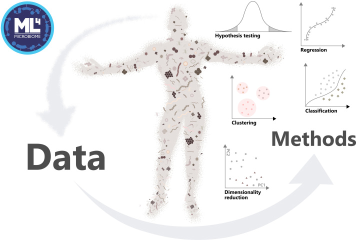

# Program

The course takes place daily from 9am – 5pm (CEST), including
coffee and lunch breaks.

We expect that participants will prepare for the course in advance, see section
\@ref(start). Online support is available.

The material follows open online book created by the course teachers,
Orchestrating Microbiome Analysis
https://microbiome.github.io/OMA. This is R/Bioconductor framework for
multi-omic data science.

Figure source: Moreno-Indias _et al_. (2021) [Statistical and Machine Learning Techniques in Human Microbiome Studies: Contemporary Challenges and Solutions](https://doi.org/10.3389/fmicb.2021.635781). Frontiers in Microbiology 12:11.

## Day 1 - Open data science 

**Morning session**

9-10 Coffee, Welcome & Practicalities

10-11 Lecture: Open & reproducible workflows 

11-12 Demo & hands-on: Introduction to CSC RStudio notebook 

12-13 Lunch break

**Afternoon hands-on session**

13-15 Demo: Data science framework

15-17 Hands-on: microbiome data summaries & exploration 

17-18 Presentations & Discussion

----------------------------------------------------------------

## Day 2 - Tabular data 

**Morning session**

 9-10 Lecture: Analysis & visualization of _tabular data_

10-12 Demo & hands-on: Univariate methods

12-13 Lunch break

**Afternoon hands-on session**

13-14 Demo: Multivariate data analysis & visualization

14-17 Hands-on: Multivariate data analysis & visualization

17-18 Presentations & Discussion

----------------------------------------------------------------

## Day 3 - Multi-assay data

**Morning session**

 9-10 Lecture: multi-omic data integration

10-12 Demo & hands-on: multi-assay data container

12-13 Lunch break

**Afternoon hands-on session**

13-15: Demo & hands-on: association analysis

13-17: Demo & hands-on: machine learning

17-18 Presentations & Discussion

-----------------------------------------------------------------

## Day 4 - Advanced topics

**Morning session**

 9-10 Summary of the learning material

10-12 Demo & hands-on: custom data & advanced tools

12-13 Q & A session

**Afternoon session**

13-14 Lunch

14-16 Wrap-up

